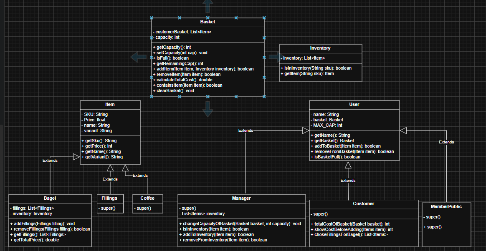

# Bobs bagel

---
As a member of the public,\
So I can order a bagel before work,\
I'd like to add a specific type of bagel to my basket.
---
As a member of the public,\
So I can change my order,\
I'd like to remove a bagel from my basket.
---
As a member of the public,\
So that I can not overfill my small bagel basket\
I'd like to know when my basket is full when I try adding an item beyond my basket capacity.
---
As a Bob's Bagels manager,\
So that I can expand my business,\
I’d like to change the capacity of baskets.
---
As a member of the public\
So that I can maintain my sanity\
I'd like to know if I try to remove an item that doesn't exist in my basket.
---
As a customer,\
So I know how much money I need,\
I'd like to know the total cost of items in my basket.
---
As a customer,\
So I know what the damage will be,\
I'd like to know the cost of a bagel before I add it to my basket.
---
As a customer,\
So I can shake things up a bit,\
I'd like to be able to choose fillings for my bagel.
---
As a customer,\
So I don't over-spend,\
I'd like to know the cost of each filling before I add it to my bagel order.
---
As the manager,\
So we don't get any weird requests,\
I want customers to only be able to order things that we stock in our inventory.
---

## Classdiagram

## Basket
| Classes | Members       | Methods       | Scenario          | Output           | 
|---------|---------------|---------------|-------------------|------------------|
| Basket  | List\<Items>  |               |                   |                  | 
|         | capacity: int |               |                   |                  |
|         |               | getAllItems() | at least one item | return all items |
|         |               |               | empty             | return nothing   |

## Manager
| Classes | Member                 | Methods                                             | Scenario                     | Output                                         | 
|---------|------------------------|-----------------------------------------------------|------------------------------|------------------------------------------------|
| Manager | name: String           |                                                     |                              |                                                |
|         | List\<Items> Inventory |                                                     |                              |                                                |
|         |                        | changeCapacity(Basket basket, int capacity)         | capacity > oldCapacity       | change capacity to new capacity                | 
|         |                        |                                                     | capacity <= oldCapacity      | return message to show new capacity is too low | 
|         |                        | onlyOrderFillingsInInventory(List\<Items> fillings) | fillings is in inventory     | make bagel and serve customer                  | 
|         |                        |                                                     | fillings is not in inventory | tell customer that filling is not available    |

## Customer
| Classes  | Member         | Methods                                                | Scenario                    | Output                                         |
|----------|----------------|--------------------------------------------------------|-----------------------------|------------------------------------------------|
| Customer | name:String    |                                                        |                             |                                                |
|          | basket: Basket |                                                        |                             |                                                |
|          |                | totalCostOfBasket(Basket basket)                       | emptyBasket                 | show 0                                         |    
|          |                |                                                        | at least one item in basket | calculate cost                                 |    
|          |                | showCostBeforeAdding(Items item (bagels and fillings)) | valid item                  | show cost                                      |    
|          |                |                                                        | not valid item              | tell item is not valid                         |    
|          |                | choseFillingsForBagel()                                | fillings in inventory       | add fillings to basket                         |    
|          |                |                                                        | fillings not in inventory   | inform customer that fillings not in inventory |

## MemberPublic
| Classes      | Member         | Methods                | Scenario                      | Output                                                  |
|--------------|----------------|------------------------|-------------------------------|---------------------------------------------------------|
| MemberPublic | name: String   |                        |                               |                                                         |
|              | basket: Basket |                        |                               |                                                         |              
|              |                | addBagel(Items item)   | basket not full               | add bagel to basket                                     |
|              |                |                        | basket full                   | not able to add,  show user message that basket is full |
|              |                | removeItem(Items item) | basket empty                  | not able to remove anything                             |    
|              |                |                        | basket not empty              | able to remove said bagel                               |   
|              |                |                        | item does not exist in basket | show message that item does not exist                   |

## Items
| Classes | Member          | Methods      | Scenario              | Output         |
|---------|-----------------|--------------|-----------------------|----------------|
| Items   | SKU: String     |              |                       |                |
|         | Price: float    |              |                       |                |    
|         | name: String    |              |                       |                |    
|         | Variant: String |              |                       |                |    
|         |                 | getSKU()     | SKU available         | return SKU     |    
|         |                 |              | SKU not available     | return nothing |    
|         |                 | getPrice()   | Price available       | return price   |    
|         |                 |              | price not available   | return nothing |    
|         |                 | getName()    | name available        | return name    |
|         |                 |              | name not available    | return nothing |
|         |                 | getVariant() | variant available     | return variant |
|         |                 |              | variant not available | return nothing |    

